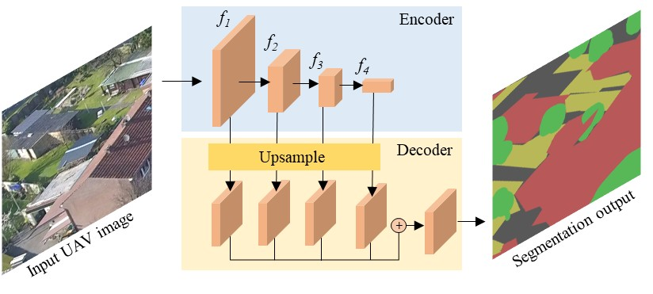
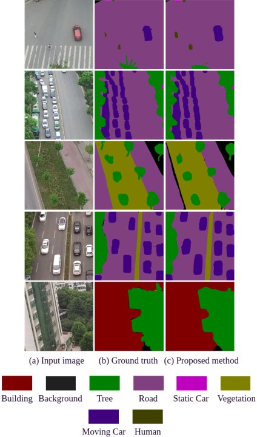
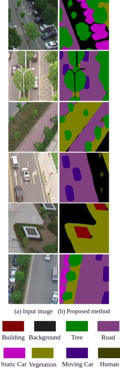
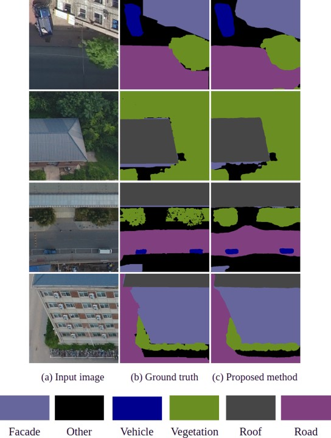

#  Encoder-Decoder Architecture based UAV Image Segmentation Network 

- We designed a deep learning based semantic segmentation network for an Unmanned Aerial Vehicle (UAV) scenes. 

- We construct a transformer based encoder-decoder network which produces hierarchical feature representations. The encoder is based on the transformer framework, where as the decoder is based on convolution neural networks.

Network:
------- 

<figure style="margin:0">
  
  <figcaption style="text-align:center;">Fig. 1. The schematic overview of the proposed UAV Segmentation Network. Input UAV image is processed using an encoder-decoder framework for its segmentation. The size of each block corresponds to the size of the corresponding features.</figcaption>
</figure>

Results:
-------- 
Quantitative result on UAVid dataset:

| Building  | Tree  | Clutter | Road    | Low vegetation  | Static Car | Moving Car | Human | mIoU (%) | OA (%)  |
|-----------|-------|---------|---------|-----------------|------------|------------|-------|----------|---------| 
|  85.99    | 77.55 |  64.93  |  77.00  | 61.98           | 54.30      | 67.06      | 26.01 |    64.35 |  84.84  |

   
  Fig. 2. The qualitative prediction results on the UAVid validation dataset.

   
  Fig. 3. The qualitative prediction results on the UAVid test dataset.

Quantitative result on UDD-6 dataset:

| Other  | Facade | Road    |  Vegetation   |  Vehicle  |  Roof  | mIou (%) |  Mean F1 (%) | OA (%)  |
|--------|--------|---------|---------------|-----------|--------|----------|--------------|---------| 
|  60.92 | 71.65  |  68.40  |  89.41        | 70.51     | 86.93  | 74.64    | 85.09        | 87.35   |

   
  Fig. 4. The qualitative prediction results on the UDD-6 validation dataset.

